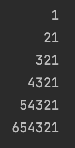
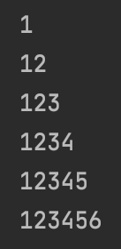
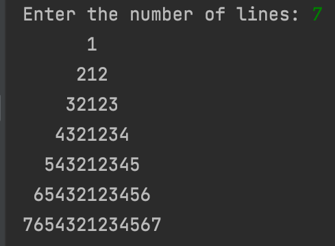
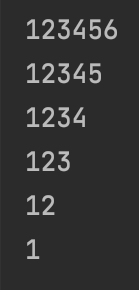
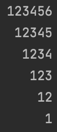

<h1> Pyramids and Triangles In Java</h1>

<h3>RightTriangle.java:</h3>

This file includes code to create a right aligned triangle with the numbers 1-6, repeating every row.

<h3>LeftTriangle.java:</h3>

This file includes code to create a left aligned triangle with the numbers 1-6, repeating every row.

<h3>NumPyramid.java:</h3>

This file includes code to create a pyramid with the length being taken from the user. The numbers start at 1 in the center of the row and go to the user-entered number. Repeats every row.

<h3>UpsideDownLeftTriangle.java:</h3>

This file includes code to create a left aligned upside down triangle with the numbers 1-6, repeating every row.

<h3>UpsideDownRightTriangle.java:</h3>

This file includes code to create a right aligned upside down triangle with the numbers 1-6, repeating every row.

